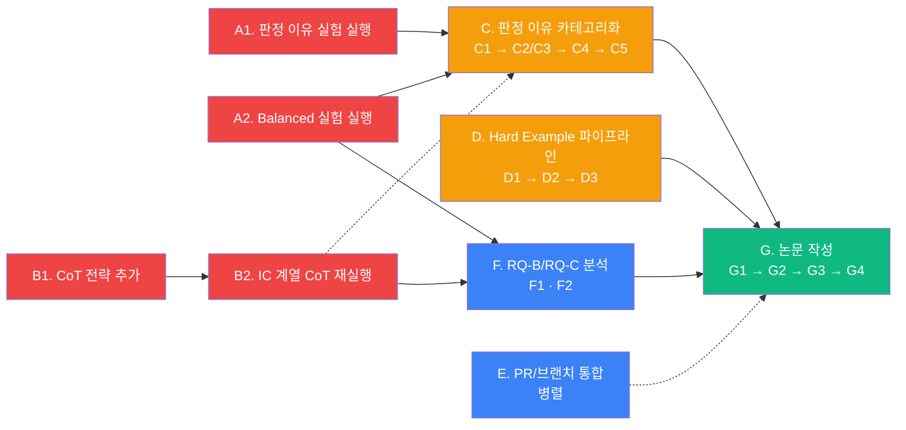

> **Execution status (2026-04-21 세션)**: 하이브리드 경로 채택 후 Phase C/D/F 스캐폴드 완성.
> - A1: ✅ Skip (기존 `eval_metacognitive.json`에서 287 solvable reason 확보, C2 sanity check 통과)
> - A2: 대기 (balanced 실제 실행은 별도 세션)
> - B1: ✅ `ic_cot_trace` 전략 추가 (7 전략으로 확장, regression 없음)
> - B2: 대기 (API 실행 필요)
> - C1: ✅ `merge_reason_codings.py` + Cohen's Kappa 구현 + 10 unit test 통과
> - C2: ✅ Sanity check 완료 — EA/SA v0 적합, IC 샘플 부족 확인, MISSING 통합 제안
> - D1: ✅ 238문제 전수 candidate 추출 + validator 실행 — 75/125 validated (60%)
> - F1 초안: ✅ `compute_memorization_score.py` + R4 필터 — IC 계열 Memorization Score 0.10~0.14 관측
> - F2 초안: ✅ `fit_salience_regression.py` + class imbalance 처리 — 예상대로 IC positive sparse
> - 관련 PR: #2 (W3 prep) — 본 세션 추가분은 후속 커밋 예정

# feat: CIKM 2026 Short 실행 계획 — 우선순위 기반 Phase 구조

## Overview

4/15 팀 싱크에서 확정된 연구 방향 전환(binary classification → judgment reason 카테고리화 + hard example 생성)과 새로 발견된 측정 한계(POT가 IC 판정을 가림)를 반영한 **CIKM 2026 Short 제출까지의 기술 실행 계획**.

시간축(이번 주/다음 주)이 아닌 **의존성과 중요도 기반 Phase**로 재구성하여, 각 Phase가 끝나는 순간 다음 Phase를 바로 착수할 수 있도록 함. 로컬 모델 실험은 GPU 의존성으로 별도 backlog로 이미 분리됨 (see [docs/backlog/local_model_experiment.md](../backlog/local_model_experiment.md)).

## Problem Frame

**연구 질문 변화 (4/15 회의)**:
- RQ-A (기존): FinanceReasoning에서 absence vs conflict 비대칭 + IC L1-L4 gradient
- **RQ-A1 (신규)**: 모델이 거부할 때 *왜* 못 푸는지(reason)를 정확히 짚어내는가? — 메타인지 Part 2
- **RQ-A2 (신규)**: IC-L1/L2처럼 정답 재계산 가능한 변형에서 hard example accuracy는?
- RQ-B: POT 응답의 값 출처 (Value Provenance + Memorization Score)
- RQ-C: Conflict Salience Regression (IC 탐지를 예측하는 feature)

**측정 도구의 한계 (4/15 발견)**:
- POT(Program-of-Thought)는 코드만 출력 → IC-L2/L3/L4의 "어느 값을 왜 선택했는지" 추적 불가
- 1million 암기 현상: context에 없는 원본값을 모델이 회상 (Gemini 강·GPT 약·Claude 혼재) → RQ-B 타당성 위협

**스코프**:
- Primary target: **CIKM 2026 Short (4p, 마감 2026-06-06 AoE)** — D-45
- Follow-up: AAAI 2027 (마감 2026-08-01) — 본 plan 범위 밖

## Requirements Trace

- **R1**: 4/15 회의 Decision 1 — 판정 이유 카테고리화(A1) + Hard example(A2) 2축 추가 (origin: `docs/meetings/2026-04-15-team-sync.md`, `docs/memory/project_rq_direction_shift_2026_04_15.md`)
- **R2**: 4/15 회의 Decision 2 — POT→CoT 전환, POT 한계 자체를 CIKM finding으로 승격 (see `docs/memory/project_pot_limitation_ic.md`)
- **R3**: 4/15 회의 Decision 3 — 1million 암기 현상을 RQ-B 직접 증거로 활용 (see `docs/memory/project_pot_faithfulness_rqb.md`)
- **R4**: 4/15 회의 Decision 4 — 원본 오답 문제는 메인 분석에서 제외 (see `docs/memory/feedback_exclude_baseline_wrong.md`)
- **R5**: 4/15 Action Item #1 — 판정 이유 프롬프트 실험 실행 (10문제 × 6변형 × 3모델 ≈ 180 reason)
- **R6**: 4/15 Action Item #4 — 판정 이유 4 카테고리 × 변형 6유형 매트릭스 분석 (카테고리 v0 → v1 확정 미팅)
- **R7**: Submission Strategy — CIKM Short에 RQ-A/B/C 포함 (see `docs/memory/project_submission_strategy.md`)
- **R8**: 논문 제출 (4p, 2026-06-06 AoE)

## Scope Boundaries

**In scope**:
- 판정 이유 카테고리화 파이프라인 실행
- Hard example 정답 재계산 파이프라인 실행
- CoT/reason-first 프롬프트 전략 추가 + IC 재실행
- Balanced 모델 실험 (gpt-4o, claude-sonnet-4, gemini-2.5-pro)
- Value Provenance Classifier 적용 (RQ-B)
- Conflict Salience Regression fitting (RQ-C)
- CIKM Short 논문 4p 작성 & 제출

### Deferred to Separate Tasks

- **로컬 모델(Llama/qwen2.5) 실험** — GPU 의존성으로 DEFERRED. 재개 계획은 `docs/backlog/local_model_experiment.md`
- **Cross-domain (법률/의료) IC validation** — AAAI 2027로 이월 (`TODOS.md` P2)
- **Attention pattern analysis** — GPU 확보 후. AAAI 2027 이후 (`TODOS.md` P2)
- **Multi-agent mitigation 연구** — AAAI 2027 핵심 (회의에서 "8월 쯤" 타임라인 명시)

**Non-goals**:
- 새 LLM 프로바이더 추가
- 프레임워크 마이그레이션
- 논문 Full Research 또는 Resource Papers 트랙 전환

## Context & Research

### Relevant Code and Patterns

| 파일 | 역할 |
|------|------|
| `evaluation/refusal_detector.py` | 응답 분류 (refused/caveat/confident/error) + reason 제공 |
| `evaluation/model_runner.py` | 프롬프트 전략 라우팅, OpenAI/Anthropic/Google 프로바이더 |
| `experiments/run_batch_evaluation.py` | 배치 평가 (checkpoint/resume 지원) — `refusal_reason` 필드 저장 로직 (line 255-265) |
| `experiments/run_balanced_experiment.sh` | dry-run 스크립트 — `--execute` 플래그로 실행 |
| `experiments/generate_reason_coding_workbook.py` | W3 prep에서 작성 — 수동 코딩 HTML |
| `experiments/extract_ic_l1_l2_candidates.py` | W3 prep — candidate 추출 + 매칭 스코어링 |
| `experiments/validate_hard_example.py` | W3 prep — 샌드박스 실행 + 리터럴 치환 |
| `experiments/generate_hard_example_review.py` | W3 prep — 검수 HTML |
| `evaluation/reasoning_trace_analyzer.py` | NumberExtractor + ValueProvenanceClassifier 초안 (RQ-B) |
| `experiments/conflict_salience_scorer.py` | Salience feature + regression 초안 (RQ-C) |

### Institutional Learnings (docs/memory/)

- `project_rq_direction_shift_2026_04_15.md` — 2축 확장 설계
- `project_pot_limitation_ic.md` — POT→CoT 전환 결정
- `project_reason_categories_draft.md` — v0 6개 카테고리 + Kappa 프로토콜
- `project_pot_faithfulness_rqb.md` — 1million 모델별 증거 + Value Provenance Classifier 필요성
- `project_conflict_salience_rqc.md` — Salience feature (token_distance, authority_marker, magnitude_ratio, same_paragraph)
- `project_submission_strategy.md` — CIKM Short 3p+competitive positioning
- `feedback_exclude_baseline_wrong.md` — 원본 오답 제외 정책
- `feedback_llm_based_transformation.md` — 변환은 LLM 기반 원칙

### External References

- AbstentionBench (arXiv:2506.09038) — 일반 abstention, conflict 미커버 → 차별화 포지션
- ConflictBank (NeurIPS 2024, arXiv:2408.12076) — RAG 검색 충돌 → intra-context 수치 충돌 약함으로 차별화
- MAGIC (Findings EMNLP 2025) — multi-hop gradient, 수치 ladder·financial 도메인 아님으로 차별화
- Feng+2024 — Abstention F1 (refusal metric)
- Yang+2024 "Alignment for Honesty" (arXiv:2312.07000) — Over-Conservatism Rate
- Lanham+2023 (arXiv:2307.13702) — CoT Faithfulness 원조 개념

## Key Technical Decisions

- **Phase를 의존성·중요도로 묶되 Critical Path를 2개로 설정 (A+B 병렬)**: 데이터 수집(A)과 측정 도구 신뢰성 확보(B)는 독립적으로 진행 가능하며 둘 다 없으면 논문 성립 X.
- **카테고리 v0로 수집 후 확정**: reason 180개 수집 전에는 카테고리 완전 확정 불가 → v0 가설 → Kappa로 검증 → v1 확정 방식.
- **POT 한계를 Finding으로 승격**: 전부 CoT로 갈아엎는 대신 IC 계열만 CoT 분기. EA 계열 POT는 유지 (비교 baseline이 됨).
- **Hard example 규모는 candidate pool로 결정**: 목표 24개지만 pool이 더 작으면 가능한 만큼. 통계 유의성보다 표본 검증 우선.
- **원본 오답 제외 경로는 메인 트랙 / 포함은 부록 트랙**: MC Score solvable 모집단 = 원본 맞춘 문제로 한정 (R4).
- **agent 브랜치 5커밋은 주제별 2 PR로 분할**: 판정 이유 프롬프트 인프라(W2 실험 의존) / Phase A 분석+dry-run(독립).
- **논문 섹션 초안은 Phase C/D/F 결과 확정 후 시작**: Results 먼저 작성, Related/Discussion은 데이터 가시화 후.
- **장기 작업은 planning-time이 아닌 execution-time 조정 허용**: 예) candidate pool이 12개로 나와 hard example 규모 축소 시, plan 수정 없이 진행. 단 논문 framing에 영향 시 재검토.

## Open Questions

### Resolved During Planning

- **Phase 간 순서**: A+B는 critical path로 병렬. C는 A1 reason 수집 의존. D는 기존 batch_transformations만 필요(A/B 독립). F는 A+B 수렴 후. G는 C/D/F 결과 수렴 후. E(PR 정리)는 언제든 병렬.
- **카테고리 수 (6 vs 5)**: v0 6개로 시작. Kappa 측정 후 통합/분리 판단 — 문서(`project_reason_categories_draft.md`) 이미 이 경로 명시.
- **Hard example 정답 치환 휴리스틱**: IC-L1 = 10x, IC-L2 = 1.5x 기본. 사람 검수에서 조정 가능.

### Deferred to Implementation

- **CoT 프롬프트 구체 문구**: Phase B1에서 설계. few-shot 예시 포함 여부는 spot-check로 결정.
- **Memorization Score 임계값**: Phase F1 실행 중 결정 (경쟁 논문 참조값에 맞출지, 관측값 기반 cutoff 설정할지).
- **Hard example 실제 규모**: Phase D1 candidate 추출 결과에 따라 확정.
- **PR-A/PR-B 분할 내 순서**: E1에서 agent 브랜치 5커밋의 실제 diff 보며 결정 (재분할 가능).
- **논문 figures 구체 매수**: G2에서 초고 작성하며 결정 (4페이지 제약으로 2~3 figures).
- **Force-choice 실험 포함 여부**: 회의 [57:57] Speaker 1이 제안한 "모델에 강제로 답하게 시키고 어느 값을 선택하는지 경향 분석". CIKM 4p 스코프에 포함할지, AAAI 후속 논문으로 미룰지 결정. F2(Salience)가 이미 "어느 값 선택" 질문에 부분 답을 주므로 기본안은 AAAI 이월 — 단, B2 재실행 결과에서 판단 여지가 크게 남으면 재검토.

## High-Level Technical Design

> *아래 의존성 그래프는 Phase 간 의존·병렬 관계를 보여주기 위한 직관적 가이드이며, 구현 명세가 아닙니다. 구현자는 실제 상황에 맞게 순서를 조정할 수 있습니다.*

**우선순위 구분**:
- 🔴 **Critical (Phase A, B)** — 데이터 + 측정 도구 신뢰성. 미완료 시 논문 전체 무효
- 🟠 **High (Phase C, D)** — 두 신규 앵글 완주. 각각 1/3 contribution
- 🔵 **Medium (Phase E, F)** — 통합 작업 + 분석 도구
- 🟢 **Publication (Phase G)** — 수렴 후 작성

## Implementation Units

---

### Phase A: Critical — Data Infrastructure 가동

#### - [ ] **A1: 판정 이유 실험 실행 (10문제 × 6변형 × 3모델)**

**Goal:** `INSUFFICIENT_INFORMATION: <reason>` 프롬프트로 reason 수집 (~180 샘플). Phase C 코딩 입력.

**Requirements:** R5, R7

**Dependencies:** 없음 (프롬프트 커밋 12902ed 완료됨)

**Files:**
- Run: `experiments/run_batch_evaluation.py`
- Input: `experiments/results/metacognitive/batch_transformations_0_238.json` (기존)
- Output: `experiments/results/metacognitive/evaluation_results_economic_<strategy>_<timestamp>.json`

**Approach:**
- economic budget(gpt-4o-mini, claude-haiku-4, gemini-2.5-flash) × 10 hard 문제 × 6 변형(EA-partial/full, SA, IC-L1/L2/L3 — IC-L4/TA는 skip) × metacognitive 전략
- 비용 추정: ~$0.09 (economic pilot 기준)
- checkpoint/resume 지원 — 중단 재시작 가능

**Patterns to follow:**
- 기존 `run_batch_evaluation.py` 호출 패턴 (PR #2 README에 명시)

**Test scenarios:**
- Happy path: 출력 JSON에 `refusal_reason` 필드가 거부 응답 수만큼 존재
- Edge case: 모델이 `INSUFFICIENT_INFORMATION:` 없이 그냥 숫자 답만 낸 경우 → `refusal_reason: null` 기록
- Error path: API 실패 시 checkpoint로 재개되는지 (단일 문제만 재시도)
- Integration: 이후 `generate_reason_coding_workbook.py --input <output>` 실행 시 레코드 로드됨

**Verification:**
- 결과 JSON의 `response_type == "refused"` 레코드 수 ≥ 80 (기대 60%+)
- `refusal_reason` 필드 non-null 비율 ≥ 70% (프롬프트 설계 목표)
- smoke: workbook HTML 생성 가능

---

#### - [ ] **A2: Balanced 모델 실험 실행 (gpt-4o, claude-sonnet-4, gemini-2.5-pro)**

**Goal:** 3 balanced 모델 × 4 전략 × 238 문제로 RQ-A 비대칭성 통계 유의성 확보 + Phase F 입력.

**Requirements:** R7

**Dependencies:** 없음 (dry-run 스크립트 준비됨, 커밋 78f3367)

**Files:**
- Run: `experiments/run_balanced_experiment.sh --execute --strategy all`
- Output: `experiments/results/metacognitive/evaluation_results_balanced_*.json`

**Approach:**
- 모델: gpt-4o, claude-sonnet-4, gemini-2.5-pro
- 전략: standard, metacognitive, self_verification, contradiction_aware (4개)
- 비용 추정: $5~8 (dry-run 스크립트 §예상 비용 참조)
- concurrency: 3 (기본값, API rate-limit 고려)

**Patterns to follow:**
- `run_balanced_experiment.sh`의 env-check 패턴 (API 키 3종 확인)

**Test scenarios:**
- Happy path: 4개 전략 각각 완료 후 JSON 3개 생성 (모델별)
- Error path: 한 모델 API key 누락 시 다른 모델만 진행
- Integration: 결과를 Phase F1(Value Provenance Classifier)이 읽을 수 있는 포맷 유지

**Verification:**
- 각 모델·전략 조합의 성공률 ≥ 90%
- 총 비용이 $10 미만 (예산 내)
- 결과 파일이 `run_validation_pipeline.py`의 입력 포맷과 호환

---

### Phase B: Critical — Measurement Validity (POT 한계 대응)

#### - [ ] **B1: `ic_cot_trace` 프롬프트 전략 추가**

**Goal:** POT가 가리는 "값 선택 이유"를 명시적으로 뽑는 CoT 전략 구현.

**Requirements:** R2

**Dependencies:** 없음 (독립 코드 추가)

**Files:**
- Modify: `evaluation/model_runner.py` (프롬프트 전략 레지스트리에 추가)
- Modify: `experiments/run_batch_evaluation.py` (전략 스위치에 `ic_cot_trace` 추가)
- Test: `tests/test_ic_cot_trace_prompt.py` (신규)

**Approach:**
- 프롬프트 구조: "**필요한 값 식별 (인용)** → **식 작성** → **값 대입 (출처 명시)** → **답**"
- 각 수치에 `[from: <field name / source>]` 태그 요구
- IC-L2/L3/L4 변형에만 적용 (EA 계열은 POT 유지 — 비교 baseline)
- few-shot 예시 1~2개 포함 (spot-check 후 결정)

**Execution note:** 테스트부터 작성. `ic_cot_trace` 프롬프트로 IC-L3 샘플 3개 호출 → 출력이 "값 선택 이유"를 실제로 포함하는지 assertion.

**Patterns to follow:**
- 기존 `metacognitive`, `contradiction_aware` 전략 추가 패턴

**Test scenarios:**
- Happy path: IC-L3 입력 → 출력에 "두 값이 공존" 또는 "출처별 차이" 서술 포함
- Edge case: 충돌이 없는 문제 → CoT 포맷은 유지하되 선택 이유 생략
- Integration: `run_batch_evaluation.py --prompt-strategy ic_cot_trace` 플래그로 기존 파이프라인과 호환
- Error path: 모델이 CoT 포맷 이탈(바로 답만) → parser가 fallback으로 POT 추출 시도

**Verification:**
- 단위 테스트 전체 통과
- 샘플 3개 실제 호출 → reasoning trace 길이 ≥ 200 토큰 (CoT 보장)
- 기존 전략 4개는 regression 없음

---

#### - [ ] **B2: IC 계열 CoT 재실행 (L2/L3/L4)**

**Goal:** B1의 `ic_cot_trace` 전략으로 IC 변형만 재평가 → F2(Conflict Salience Regression)의 입력으로 "값 선택 이유" 제공.

**Requirements:** R2, R7

**Dependencies:** B1

**Files:**
- Run: `experiments/run_batch_evaluation.py --prompt-strategy ic_cot_trace`
- Input: Phase 0 변환 결과 (기존)
- Output: `experiments/results/metacognitive/evaluation_results_*_ic_cot_trace_*.json`

**Approach:**
- economic + balanced 6모델 × IC-L2/L3/L4 변형만
- IC-L1은 10x typo라 POT로도 측정 가능 → 제외 선택 (비용 절감)
- 비용 추정: $3~5

**Test scenarios:**
- Happy path: 각 (모델, IC-level) 조합에서 최소 하나의 응답이 "값 선택 이유" 포함
- Integration: 출력 JSON이 F2 입력 스키마(question_id, selected_value, reasoning_text)와 호환

**Verification:**
- "값 선택 이유" 포함 비율 ≥ 60% (CoT 프롬프트 효과 확인)
- F2 스크립트가 파일을 파싱 가능

---

### Phase C: High — A1 앵글 완주 (판정 이유 카테고리화)

#### - [ ] **C1: `merge_reason_codings.py` — Kappa 계산 + 불일치 HTML**

**Goal:** 2인 코더 결과 JSON을 머지하고 Cohen's Kappa 자동 계산. 불일치 케이스를 HTML로 가시화하여 합의 미팅 지원.

**Requirements:** R6

**Dependencies:** 없음 (독립 유틸)

**Files:**
- Create: `experiments/merge_reason_codings.py`
- Test: `tests/test_merge_reason_codings.py`

**Approach:**
- Input: `reason_coding_<coder1>_*.json`, `reason_coding_<coder2>_*.json`
- Output: `reason_coding_merged_<range>.json` + `reason_coding_disagreement_<range>.html`
- Kappa 계산: `sklearn.metrics.cohen_kappa_score` 또는 자체 구현 (의존성 추가 회피)
- 합의 규칙: confidence 높은 쪽 우선, 같으면 primary(jkcost) 채택 + diff 메모 보존
- 불일치 HTML: reason 원문 + 두 코더의 카테고리 + note 나란히 + 제3자 선택 폼

**Execution note:** TDD — fixture JSON 2개로 Kappa 수치 예제 assertion부터.

**Patterns to follow:**
- `experiments/merge_annotations.py` (기존 annotation 머지 스크립트) — 구조 참고

**Test scenarios:**
- Happy path: 2 JSON 모두 완전 일치 → Kappa = 1.0
- Edge case: 모든 항목 불일치 → Kappa ≤ 0
- Edge case: 한 쪽에만 있는 항목 → 머지 시 경고 + 단일 채택
- Error path: 잘못된 category 값 (v0에 없음) → 에러 + 파일명/인덱스 표시
- Integration: disagreement HTML에서 제3자가 결정 → merged JSON 업데이트 가능

**Verification:**
- smoke: fixture 2개 → Kappa 계산 수치 = 예상값
- 산출 HTML이 브라우저에서 정상 렌더링
- `merged.json`이 `project_reason_categories_draft.md`의 스키마 준수

---

#### - [ ] **C2: 카테고리 v0 sanity check (수집된 reason 100개 스팟)**

**Goal:** A1 결과의 reason 샘플 100개를 빠르게 훑어 v0 카테고리 6개가 현실과 맞는지 검증. 본 수동 코딩 전 "카테고리 재설계" 필요 여부 판단.

**Requirements:** R6

**Dependencies:** A1 완료

**Files:**
- Read: A1 출력 JSON
- Update: `docs/memory/project_reason_categories_draft.md` (v0 → v0.5 refine 필요 시)

**Approach:**
- `generate_reason_coding_workbook.py` HTML로 100개 훑기 (코딩은 X, "어느 카테고리가 맞을지 감잡기" 용도)
- 명백히 안 맞는 reason이 20% 이상 → v0 refine
- UNCATEGORIZABLE이 15% 이상 → 신규 카테고리 후보 발견

**Test expectation:** none — exploratory review pass. 산출물은 draft.md 업데이트.

**Verification:**
- draft.md에 "v0 sanity check 결과" 섹션 추가 (refine 여부 + 근거)

---

#### - [ ] **C3: 2인 수동 코딩 (정식 180개)**

**Goal:** 진규 + 우익 2인이 독립 코딩. 이후 Kappa 측정 입력.

**Requirements:** R6

**Dependencies:** C1, C2 (또는 v0 유지 시 C2만)

**Files:**
- Run: workbook HTML with `?coder=jkcost&start=0&end=180`, `?coder=wooik&start=0&end=180`
- Output: `experiments/results/metacognitive/annotations/reason_coding_{jkcost,wooik}_0_180.json`

**Approach:**
- 서로의 코딩 결과 공유 금지 (독립성 보장 — `project_reason_categories_draft.md` 프로토콜)
- 코더당 ~3~4시간 예상
- 주간 회의 전까지 완료 (Action Item #4 "다음 주간 회의" 시점)

**Test expectation:** none — human coding task. 산출물 완성도는 C4의 Kappa로 검증.

**Verification:**
- 두 JSON 모두 180개 레코드 완성 (`category` 필드 non-null 비율 = 100%)

---

#### - [ ] **C4: Kappa 측정 + 카테고리 v1 확정 미팅**

**Goal:** C1 스크립트로 Kappa 산출. 결과 기반으로 카테고리 확정 or refine.

**Requirements:** R6

**Dependencies:** C1, C3

**Files:**
- Run: `experiments/merge_reason_codings.py --a <jkcost> --b <wooik>`
- Update: `docs/memory/project_reason_categories_draft.md` → v1 섹션 추가 (확정 카테고리 + 제외/통합 근거)

**Approach:**
- Kappa ≥ 0.6 → v0 확정, C5 단독 코딩으로 확장
- Kappa 0.4~0.6 → 불일치 HTML 검토 → 정의 refine → 재코딩(불일치 케이스만)
- Kappa < 0.4 → 회의에서 카테고리 재설계 (통합/분리)

**Test expectation:** none — analysis and decision step. 산출물은 draft.md v1 섹션.

**Verification:**
- `project_reason_categories_draft.md`에 "v1 확정 카테고리" 섹션 + Kappa 수치 + 회의록 링크

---

#### - [ ] **C5: 전수 reason 코딩 (balanced 결과 포함, Kappa 통과 시)**

**Goal:** Kappa 통과 시 A1 + A2 + B2 모든 reason에 카테고리 태깅. Phase G 분석 입력.

**Requirements:** R6, R7

**Dependencies:** C4 (Kappa ≥ 0.6), A2 (balanced 결과 포함), B2 (CoT 결과 포함 시 권장)

**Files:**
- Run: workbook HTML (전수 모드) 또는 단독 코더 1인
- Output: `reason_coding_all_<timestamp>.json`

**Approach:**
- 단독 코더 (primary = jkcost) — 효율 우선. 확신 낮음(low) 항목만 2인 확인.
- 규모 예상: 180 (A1) + ~400 (A2 balanced 거부분) + ~100 (B2 IC CoT) ≈ 700

**Test expectation:** none — human coding task (단독 코더).

**Verification:**
- 전체 JSON에 category 필드 non-null 비율 ≥ 95%
- 카테고리별 분포 CSV 산출 (논문 표 입력)

---

### Phase D: High — A2 앵글 완주 (Hard Example 파이프라인)

#### - [ ] **D1: Candidate 추출 + Validator 실행**

**Goal:** 238문제 기존 변환 결과에서 IC-L1/L2 hard example candidate 자동 발굴 + 정답 재계산.

**Requirements:** R1

**Dependencies:** 없음 (스크립트 & batch_transformations 준비됨)

**Files:**
- Run: `experiments/extract_ic_l1_l2_candidates.py --input <batch_transformations>`
- Run: `experiments/validate_hard_example.py --candidates ... --transformations ...`
- Output: `hard_example_candidates.json`, `hard_example_validated.json`

**Approach:**
- 모든 전체 238문제에 대해 IC-L1/L2만 추출
- match_score ≥ 0.4 threshold (기본)
- hardcoded solution은 자동 제외
- 5초 타임아웃 샌드박스로 원본/치환 정답 계산

**Test scenarios:**
- Happy path: candidate ≥ 24개 (목표 규모)
- Edge case: candidate < 24 → 목표 축소, 논문 framing 조정 필요 (decision point)
- Error path: validator 실패율 > 20% → solution 구조 분석 + 재시도 전략

**Verification:**
- `hard_example_validated.json`의 `ok == true` 비율 ≥ 60%
- 논문 표에 인용할 수 있는 규모(≥ 12) 확보

---

#### - [ ] **D2: 사람 검수 (채택/수정/기각)**

**Goal:** validated hard example을 사람이 최종 확정. 잘못된 치환, 부자연스러운 변환 제거.

**Requirements:** R1

**Dependencies:** D1

**Files:**
- Run: `experiments/generate_hard_example_review.py --validated ... --transformations ...`
- Output: `hard_example_review_<reviewer>.json`

**Approach:**
- 1인 검수 (진규). 애매하면 회의 논의.
- 채택 기준: (1) 원본↔변환 context 모두 문법적으로 자연스러움, (2) 변환이 풀이에 실제 영향, (3) Δ ratio가 의도와 일치

**Test expectation:** none — human review task.

**Verification:**
- 결정 완료율 100% (`decision != null`)
- adopt 비율 보고 (목표 ≥ 60%)

---

#### - [ ] **D3: Hard example 최종셋 → Accuracy 재측정**

**Goal:** 채택된 hard example에 대해 3모델(또는 6모델)로 POT + CoT accuracy 측정.

**Requirements:** R1, R7

**Dependencies:** D2

**Files:**
- Create: `experiments/run_hard_example_accuracy.py` (기존 `run_batch_evaluation.py` 일부 재사용 가능)
- Output: `experiments/results/metacognitive/hard_example_accuracy.json`

**Approach:**
- 채택 hard example × {original answer 풀기, new answer 풀기} × 모델
- 원본 정답 vs 새 정답 accuracy 차이 = hard example의 "난이도 증가 효과"

**Test scenarios:**
- Happy path: 원본 정답 accuracy > 새 정답 accuracy (hard example이 실제로 어려워야 함)
- Edge case: 모든 모델이 새 정답도 맞춤 → 난이도 증가 실패 케이스 분석

**Verification:**
- 논문 Table용 수치 (모델 × {original, new hard} accuracy matrix)

---

### Phase E: Medium — PR & 브랜치 통합

#### - [ ] **E1: agent 브랜치 5커밋을 2개 PR로 분할**

**Goal:** 로컬에만 있는 5커밋(12902ed, 739d902, 78f3367, b9262be, 708999f)을 팀 리뷰 가능한 PR로 올림.

**Requirements:** R5 (A1 실험 실행 전 prompt 인프라 필요)

**Dependencies:** 없음 (언제든 병렬)

**Files:**
- Cherry-pick source: `agent/meeting-2026-04-15-team-sync`
- New branches: `prompt-reason-infra-2026-04-21`, `phase-a-analysis-dry-run-2026-04-21`
- Base: `feat/metacognitive-evaluation-framework`

**Approach:**
- **PR-A (판정 이유 인프라)**: 708999f + 739d902 + 12902ed — A1 실험 실행 의존성 충족
- **PR-B (Phase A 분석 + dry-run)**: b9262be + 78f3367 — 독립, 리뷰 용이

**Patterns to follow:**
- PR #2의 cherry-pick 워크플로우 (본 plan 직전 세션에서 성공)

**Test scenarios:**
- Happy path: 두 PR 모두 머지 가능 상태 (conflict 없음)
- Integration: PR-A 머지 후 A1이 main-base에서 실행 가능

**Verification:**
- 2 PR 오픈 + 본문에 4/15 회의 링크 + E2E 설명
- A1 실험은 PR-A 머지를 기다리지 않고 `agent/meeting-...` 브랜치 또는 w3-prep-2026-04-21 머지 후 진행 가능 (병렬성)

---

#### - [ ] **E2: PR #2 (W3-prep) 리뷰 반영 + 머지**

**Goal:** 본 plan 직전 세션의 PR #2를 리뷰 → 머지 → feat 브랜치 업데이트.

**Requirements:** R1 (W3 파이프라인이 Phase C/D의 기반)

**Dependencies:** 없음

**Files:**
- PR: https://github.com/jkcost/finance-reasoning-eval/pull/2

**Approach:**
- 팀 리뷰 요청 → 피드백 반영 → squash 또는 merge commit (팀 컨벤션 따름)
- 머지 후 agent 브랜치에서 feat 브랜치로 rebase (또는 로컬 브랜치 삭제)

**Test expectation:** none — process/workflow step.

**Verification:**
- PR #2 merged 상태
- feat 브랜치에 w3-prep 3커밋 포함

---

#### - [ ] **E3: 로컬 브랜치 정리**

**Goal:** stale 브랜치 제거하여 로컬 git 상태 정리.

**Requirements:** —

**Dependencies:** E1, E2

**Files:** 없음 (git 메타데이터만)

**Approach:**
- agent/meeting-2026-04-15-team-sync, w3-prep-2026-04-21은 머지 후 삭제
- `git remote prune origin`으로 원격 삭제 브랜치 동기화

**Test expectation:** none — git maintenance.

**Verification:**
- `git branch -a` 결과에 stale 브랜치 없음

---

### Phase F: Medium — 분석 도구 (RQ-B/RQ-C)

#### - [ ] **F1: Value Provenance Classifier 적용 → Memorization Score**

**Goal:** `reasoning_trace_analyzer.py`의 ValueProvenanceClassifier를 A2/B2 결과에 적용 → 모델별 Memorization Score 산출.

**Requirements:** R3, R7

**Dependencies:** A2, B2

**Files:**
- Use: `evaluation/reasoning_trace_analyzer.py` (기존)
- Create: `experiments/compute_memorization_score.py`
- Output: `experiments/results/metacognitive/memorization_score.json` + CSV

**Approach:**
- **Solvable 모집단 필터링 (R4)**: 분석 대상은 `{qid | Phase_A(원본 컨텍스트) == correct}` 집합. 원본 오답 문제는 메인 Memorization Score 산출에서 제외, 부록 트랙으로만 보고. Phase A 결과(A2 및 기존 economic pilot)에서 정답 QID 집합 자동 추출 → 필터 적용
- 각 응답의 숫자를 5개 분류로 태깅: `from_context`, `from_removed_data`, `fabricated`, `common_constant`, `derived`
- Memorization Score = `from_removed_data` 비율 (모델별, 변형별)
- 1million 사례(test-2009 등)를 하이라이트

**Execution note:** B2 데이터 없이 A2만으로도 진행 가능하지만, CoT 추적이 있으면 분류 정확도 상승 → B2 후 권장.

**Test scenarios:**
- Happy path: Gemini Memorization Score > GPT-4o-mini > Claude-sonnet-4 (회의 관찰 재현)
- Integration: 출력 CSV가 논문 Table로 바로 전환 가능 (pandas read_csv)

**Verification:**
- 모델 × 변형 Memorization Score 표 작성
- 1million 케이스 specific 분석 paragraph (논문 inclusion)

---

#### - [ ] **F2: Conflict Salience Regression fitting**

**Goal:** 4개 feature(token_distance, authority_marker, magnitude_ratio, same_paragraph)로 IC 탐지 성공/실패 예측.

**Requirements:** R7

**Dependencies:** A2, B2 (IC 변형에 대한 detection 데이터 필요)

**Files:**
- Use: `experiments/conflict_salience_scorer.py` (기존 초안)
- Create: `experiments/fit_salience_regression.py`
- Output: `experiments/results/metacognitive/salience_regression.json` + figure

**Approach:**
- **Solvable 모집단 필터링 (R4)**: 원본 오답 문제 제외 후 IC 변형만 대상으로 회귀. F1과 동일한 솔브러블 QID 집합 재사용
- Logistic regression: `detection ∈ {refused=1, confident=0}` ~ features
- 출력: coefficient + p-value + AUC + figure (coefficient bar chart)
- B2의 CoT reasoning trace와 cross-reference (feature가 실제 언급되는지)

**Test scenarios:**
- Happy path: AUC ≥ 0.7 (feature들이 실제 유의함)
- Edge case: AUC < 0.6 → feature 재설계 필요 → 논문 framing "feature가 충분하지 않음" finding으로 전환
- Integration: B2 reasoning trace에서 authority_marker 언급 빈도 측정

**Verification:**
- 회귀 계수 표 + figure
- 논문 Section 4 (Analysis) 핵심 그래프 확정

---

### Phase G: Publication — CIKM Short 4p 작성

#### - [ ] **G1: Methodology + Experiments 섹션**

**Goal:** 방법론 (Transformation taxonomy + MC Score + Value Provenance + Salience features) + 실험 설정 기술.

**Requirements:** R8

**Dependencies:** Phase A, B, C, D, F 데이터 수렴 후

**Files:**
- Create: `paper/sections/methodology.tex` + `paper/sections/experiments.tex`
- Or: `paper/cikm_short_draft.md` (단일 파일 관리 가능)

**Approach:**
- Methodology: 변환 taxonomy 그림 (EA vs IC) + MC Score 수식 + Value Provenance 분류 + Salience 4 feature
- Experiments: 데이터셋 (hard.json 238), 모델(economic + balanced 6), 전략(POT + CoT), 변형(6)

**Test expectation:** none — writing-only unit.

**Verification:**
- 섹션 초안 완료. 1p 분량 (4p 중).

---

#### - [ ] **G2: Results + Figures**

**Goal:** 핵심 발견을 3개 표 + 2~3개 figure로 압축.

**Requirements:** R8

**Dependencies:** G1

**Files:**
- Create: `paper/sections/results.tex`
- Create: `paper/figures/ic_l1_l4_gradient.pdf`, `memorization_score.pdf`, `salience_regression.pdf`

**Approach:**
- Table 1: Model × Transformation × Refusal Rate (RQ-A)
- Table 2: Reason Category 분포 × Model (RQ-A1, Phase C5 산출)
- Table 3: Hard Example Accuracy (RQ-A2, Phase D3)
- Figure 1: IC L1-L4 gradient (line plot)
- Figure 2: Memorization Score 분포 (RQ-B)
- Figure 3: Salience coefficient + AUC (RQ-C)

**Test scenarios:**
- None

**Verification:**
- 논문 섹션 1.5p 분량
- 모든 figure vector 포맷 (PDF)

---

#### - [ ] **G3: Related Work + Discussion + Intro/Conclusion**

**Goal:** 경쟁 논문 포지셔닝 + POT 한계 논의 + 인트로/결론.

**Requirements:** R8

**Dependencies:** G2

**Files:**
- Create: `paper/sections/related_work.tex`, `discussion.tex`, `intro.tex`, `conclusion.tex`

**Approach:**
- Related Work (0.5p): AbstentionBench, ConflictBank, MAGIC vs 본 연구 차별점 3줄 각각
- Discussion (0.5p): POT measurement limitation, 1million memorization, salience의 authority bias
- Intro (0.5p): 비대칭 메타인지 + IC gradient 선언 + 3 contributions
- Conclusion (0.25p) + Limitations (0.25p)

**Test scenarios:**
- None

**Verification:**
- 총 4p 채워짐 (CIKM Short format)
- 인용 ≥ 20개 (`docs/memory/project_submission_strategy.md` 검증됨)

---

#### - [ ] **G4: Co-author review + 최종 제출**

**Goal:** 공저자 피드백 반영 + CIKM 사이트 업로드.

**Requirements:** R8

**Dependencies:** G3

**Files:**
- Review: 전체 PDF
- Submit: OpenReview/EasyChair (CIKM 투고 시스템 확인 필요)

**Approach:**
- 최소 2회 co-author 회독 (1주 전 + 제출 직전)
- 교정: 4p 한계 내 언어 압축
- Camera-ready 준비

**Test scenarios:**
- None

**Verification:**
- 제출 완료 확인 이메일
- 제출 버전 git tag: `cikm-short-submission-2026-06-06`

---

## System-Wide Impact

- **Interaction graph**: A1/A2가 생성하는 `evaluation_results_*.json` 스키마 → C workbook → C1 merge → F1/F2 분석 → G2 table/figure. 스키마 변경 시 cascading 영향 있음 (E1 PR-A가 `refusal_reason` 필드 추가 — 하류 전체 호환성 확인 필요).
- **Error propagation**: A1/A2/B2 실험 중 API 실패 시 checkpoint/resume으로 복구. 파이프라인 중단 시 다음 실행이 append 모드인지 확인.
- **State lifecycle risks**: `experiments/results/metacognitive/`는 .gitignore되어 로컬 손실 위험. **주 1회 외부 백업 권장** (Google Drive or S3). annotations/는 git-tracked.
- **API surface parity**: B1의 `ic_cot_trace` 전략 추가 시 기존 4 전략(standard/metacognitive/self_verification/contradiction_aware) regression 없어야 함. 테스트로 보장.
- **Integration coverage**: D3 hard example accuracy가 사용하는 prompt는 A1/A2와 동일 (POT 기준). 별도 전략 추가 시 Phase D3 재실행 고려.
- **Unchanged invariants**: 
  - `evaluation/metacognitive_metrics.py` MC Score 공식 유지 (v2로 확정됨, 2026-02-23)
  - `evaluation/refusal_detector.py` DetectionResult 구조 — 필드 추가만, 제거 X
  - `experiments/apply_transformations_full.py` (레거시) 미수정 — LLM 기반 파이프라인과 병존

## Risks & Dependencies

| Risk | Likelihood | Impact | Mitigation |
|------|-----------|--------|------------|
| A2 balanced 실험 비용 초과 ($10+) | Medium | Medium | dry-run으로 비용 재추정. 예산 초과 시 전략 2개로 축소 (metacognitive + ic_cot_trace만) |
| Kappa < 0.4 → 카테고리 재설계 | Medium | High (C 전체 지연) | C2 sanity check로 사전 위험 감지. 발생 시 카테고리 수 4~5개로 축소하고 재코딩 |
| Hard example candidate < 12 | Medium | High (D trunk 논문 framing 축소) | D1 실행 후 조기 파악. 부족 시 IC-L3 포함 확장 또는 논문 framing 조정 |
| B1 CoT 프롬프트가 작은 모델에서 파싱 실패 | Low | Medium | fallback으로 POT 추출 시도. 실패율 30%+ 시 economic 모델 제외하고 balanced만 |
| F2 regression AUC < 0.6 | Low | High (RQ-C 약화) | "feature가 불충분하다"를 findings로 전환. 대체 feature 탐색(감정 마커, 숫자 형식 일치도) |
| Co-author 피드백이 6/1 이후 올 경우 | Medium | Medium | G3 완료를 5/26로 앞당김. 주간 회의에서 review 스케줄 사전 공지 |
| .gitignore 결과 데이터 손실 | Low | High | 주 1회 외부 백업 (별도 action item 등록) |
| 경쟁 논문 (AbstentionBench 등)이 IC 확장 버전 발표 | Low | Medium | 5/15 시점 arxiv/OpenReview 재점검. 발견 시 positioning 섹션 재작성 |
| CIKM Short 4p 한계 초과 | Medium | Medium | G2 초안 시점에 분량 측정. 초과 시 RQ-C(Salience)를 Limitations 섹션에 brief 처리하여 우선순위 낮춘 축으로 전환. Figures를 3→2개로 축소 가능. Table 3(Hard Example)을 appendix 후보 |
| B1 CoT 추가로 기존 4 전략 regression 발생 | Low | High | B1 Test scenarios에 기존 전략 spot-check 포함. CI가 있다면 모든 전략 smoke 테스트 필수. regression 발생 시 B1 롤백하고 별도 브랜치에서 재설계 |

## Phased Delivery

### Critical Path (동시 진행 가능)

**Critical A**: Phase A (A1 + A2) — 데이터 수집  
**Critical B**: Phase B (B1 + B2) — 측정 도구 신뢰성  
**통합 E**: Phase E (언제든 병렬, 팀 리뷰 게이팅 있음)

### 앵글 완주

**Angle A1**: Phase A1 완료 후 → C1 → C2 → C3 → C4 → C5  
**Angle A2**: 독립 → D1 → D2 → D3

### 분석 통합

**분석**: A+B+C+D 완료 후 → F1 → F2 병렬 가능

### 논문 작성

**논문**: F 완료 후 → G1 → G2 → G3 → G4

### 체크포인트

- **Checkpoint 1** (Phase A 완료): 데이터 확보 확인. Phase C·F 진입 가능.
- **Checkpoint 2** (C4 Kappa 측정): 카테고리 확정 or 재설계 결정.
- **Checkpoint 3** (Phase F 완료): 논문용 모든 수치 확정. G 진입 가능.
- **Checkpoint 4** (G3 완료 = 논문 초안): 공저자 회독 시작. 최소 1주 버퍼.

## Documentation / Operational Notes

- **메모리 동기화**: 각 Phase 완료 시 `docs/memory/` 해당 파일 업데이트 (Kappa 결과, 카테고리 v1, Memorization Score 등)
- **주간 회의 자료**: C4 회의록(카테고리 확정) → `docs/meetings/YYYY-MM-DD-team-sync.md` 템플릿 유지
- **Git 백업**: `experiments/results/metacognitive/` (.gitignore) → 외부 저장소 주 1회. 가능하면 GitHub Releases 또는 Google Drive.
- **비용 tracking**: Phase A/B/D 실험 전후 API 사용량 확인. `.env`와 각 프로바이더 대시보드에서 cross-check.

## Sources & References

- **Origin document**: `docs/meetings/2026-04-15-team-sync.md`
- **Submission strategy**: `docs/memory/project_submission_strategy.md`
- **Key decisions**: 
  - `docs/memory/project_rq_direction_shift_2026_04_15.md` (2축 확장)
  - `docs/memory/project_pot_limitation_ic.md` (POT→CoT)
  - `docs/memory/project_pot_faithfulness_rqb.md` (RQ-B 1million)
  - `docs/memory/project_conflict_salience_rqc.md` (RQ-C 4 feature)
- **Carryover prep (W3)**: PR #2 — https://github.com/jkcost/finance-reasoning-eval/pull/2
- **Unresolved backlog**: `docs/backlog/local_model_experiment.md`
- **Competitive positioning**: AbstentionBench (2506.09038), ConflictBank (2408.12076), MAGIC (2025.findings-emnlp.466)
